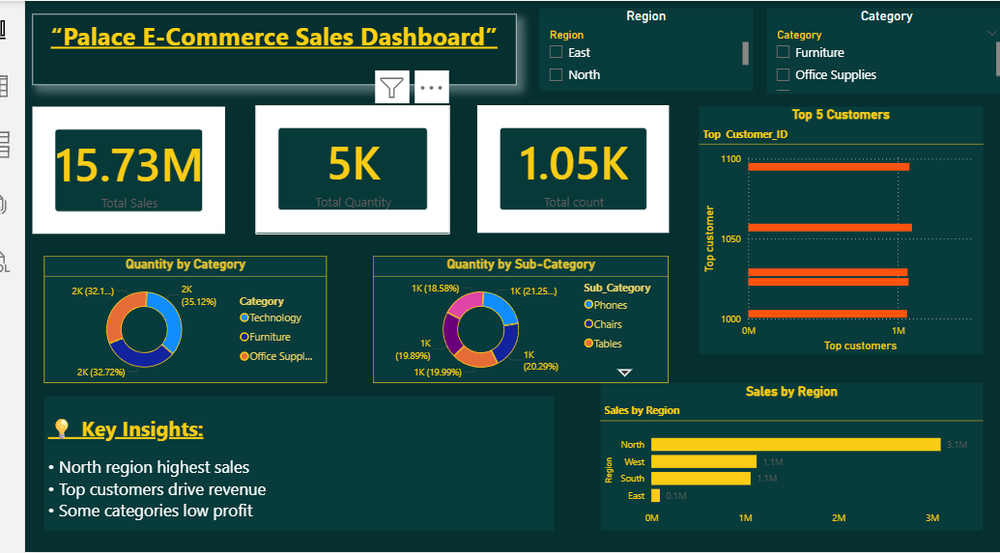

# 📊 E-Commerce Sales Dashboard

## 🔍 Problem Statement

Analyze e-commerce sales data to identify key trends, top customers, and regional performance.

## 🛠 Tools & Technologies Used

* Python (Pandas)
* SQL
* Power BI

## 📈 Key Insights

* North region generates the highest sales
* Top customers contribute major revenue
* Some categories have low profitability

## 💡 Business Recommendations

* Focus on high-performing regions
* Improve low-performing categories
* Retain top customers with offers

## 📊 Dashboard Preview

## 🚀 Conclusion

This project demonstrates end-to-end data analysis including data cleaning, SQL analysis, and dashboard creation using Power BI.
